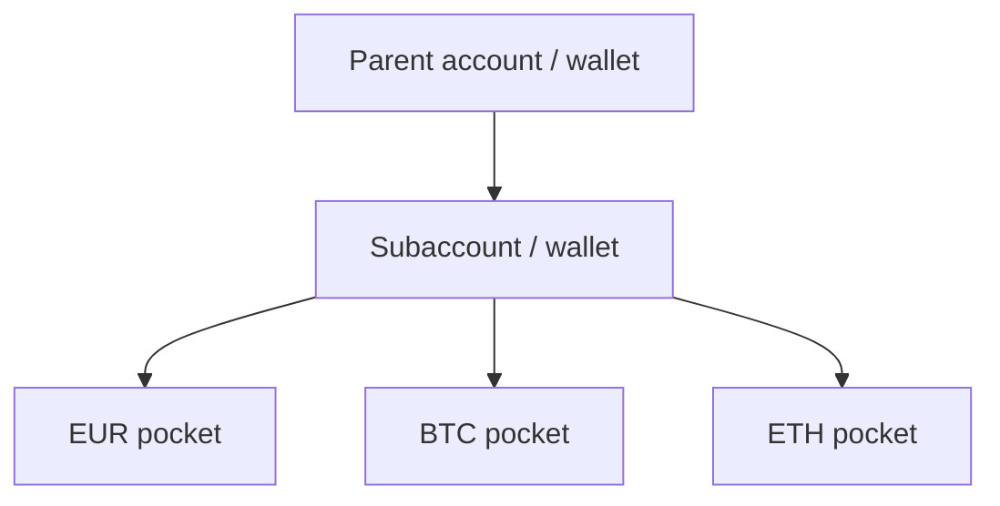

The gateway uses three layers. Get this model right before you fund, trade, or withdraw.



| Layer | What it is | How you identify it |
| --- | --- | --- |
| **Parent** | Master account created by Bit2Me and authenticated with your API keys. Parent accounts must complete KYB before operating. | API key pair |
| **Subaccount** | One wallet namespace per end user (or per corporate client). Must complete KYC (person) or KYB (`type: company`) before operating. Unlimited end users; **each user = exactly one subaccount**. | `userId` UUID in `X-SUBACCOUNT-ID` |
| **Pocket** | Optional sub-ledger per currency (EUR, BTC, ETH, …). You can also operate at wallet level. | Pocket UUID |

## Subaccount header

After you create a subaccount, send:

```http
X-SUBACCOUNT-ID: {userId}
```

Use the same value as `x-subaccount-id`. Parent HMAC headers still apply. If this header is missing, you operate the parent account — a common cause of “empty balance” tickets.

## Onboarding

- Natural person: [KYC](/partner/kyc) until `status: verified` and `tier: 2`.
- Legal entity: [KYB](/partner/kyb). Do **not** call identity init on companies.

## Funding note

A minimum fiat balance on the parent is part of initial setup. Day-to-day fiat is funded to the main account. Keep your own ledger of fiat per subaccount. USD availability on Wallet is not documented as generally available — contact sales if you need USD; Pro may have a different path.
