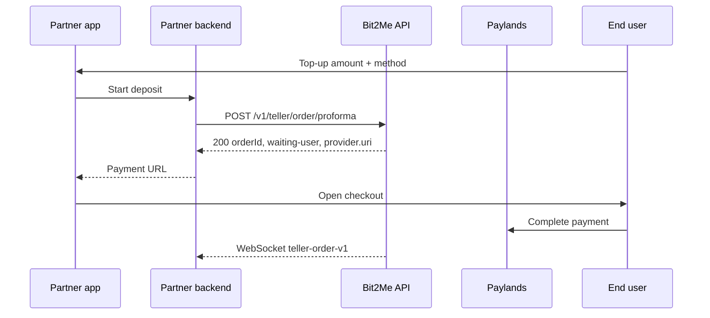

Your backend calls Bit2Me. Bit2Me returns a **Paylands** checkout URL. You do not talk to Apple or Google SDKs for this rail.

<Info>
Check [status.bit2me.com](https://status.bit2me.com) before you debug a timeout or 5xx. If the platform is healthy and the error persists, [open a support ticket](https://support.bit2me.com).
</Info>



## Create the proforma

```http
POST /v1/teller/order/proforma
```

| Method | Use |
| --- | --- |
| `creditCard` | Card deposit |
| `google-pay` | Google Pay |
| `apple-pay` | Apple Pay |
| `hub-latam` | LATAM rails (for example PIX) |

On HTTP 200 you typically receive `data.orderId`, `data.status` (`waiting-user`), `data.token`, and `data.provider.requestConfiguration.uri`. Open that URI for the user.

HTTP 200 means the **session** was created. Payment finishes on Paylands.

## UX rules (critical)

| | Google Pay | Apple Pay |
| --- | --- | --- |
| API | `method: "google-pay"` | `method: "apple-pay"` |
| Open the URI | In-app WebView is OK | **Do not** use WebView or iframe |
| Apple constraint | — | Open in **Safari / system browser** |

The API may return `"type": "iframe"`. Ignore that for Apple Pay. Apple blocks the Apple Pay button in iframes and WebViews.

Optional header if you control embed pages:

```http
Permissions-Policy: payment=(self "https://api.paylands.com")
```

This does not override Apple’s WebView rule.

## Confirm completion

| Event | Meaning |
| --- | --- |
| `teller-order-v1` | Prefer this (`orderId`, `status`, `type`, `error`) |
| `teller.deposit.card.success` | Legacy; prefer `teller-order-v1` |
| `wallet-transaction-v1` | Wallet movement (may include `tellerId`) |

Optional poll: `GET /v1/teller/order/status`.
