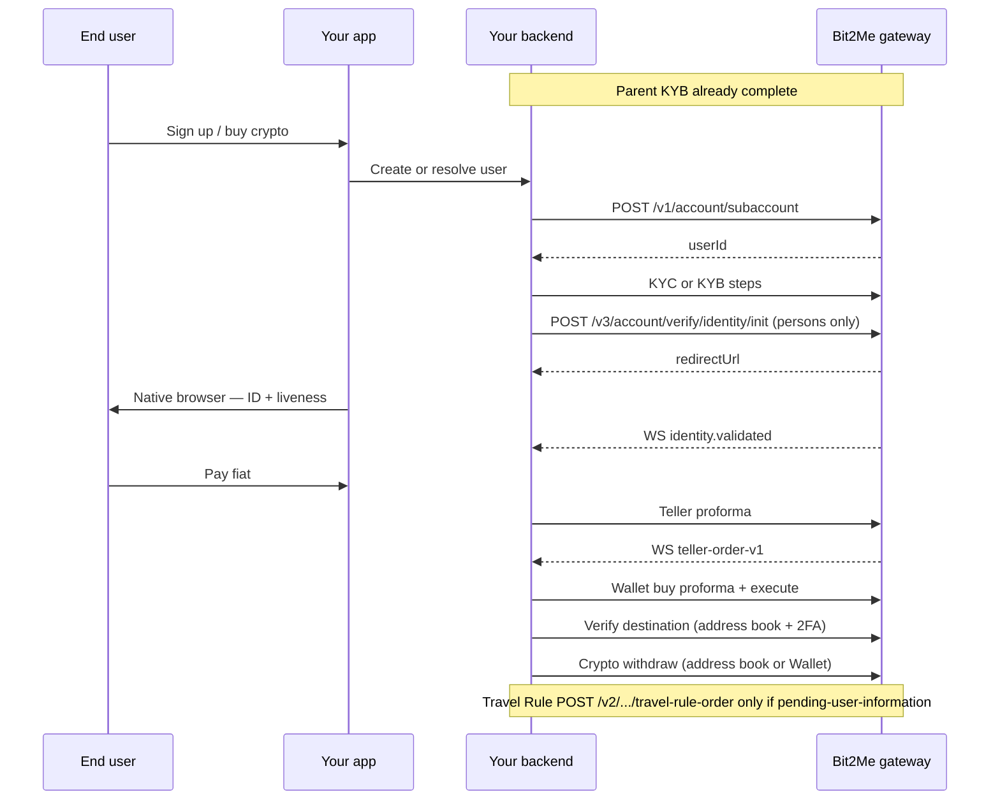

{/* COMPLIANCE_BLOCKER */}

Genericize this map for any bank or neobroker. Do not copy a single partner's contract.

## Auth layers

| Layer | Mechanism | Used for |
| --- | --- | --- |
| Parent HMAC | `x-api-key`, `api-signature`, `x-nonce` | Create subaccount, server-side treasury |
| Subaccount header | `X-SUBACCOUNT-ID: {userId}` | User-scoped REST |
| Subaccount session | `POST /v1/signin/apikey` with `userId` | Embed widgets, some identity init contracts |
| 2FA | `x-totp` + `x-totp-type: gauth` | Withdrawals and other protected ops |

## Money path

1. Fiat arrives on Bit2Me rails (bank, card, wallet pay).
2. Crypto is bought into **subaccount pockets**.
3. Delivery to the user is an **on-chain withdrawal** to an external address — not a second custodial wallet you invent.

Keep your own ledger of fiat allocated per subaccount. A minimum parent fiat balance can be part of initial setup. USD on Wallet is not documented as generally available.

<Warning>
This page describes the published API. It is not legal advice. Bit2Me Legal and Compliance must review KYC, KYB, Travel Rule, and 2FA copy before this portal is announced to partners.
</Warning>
