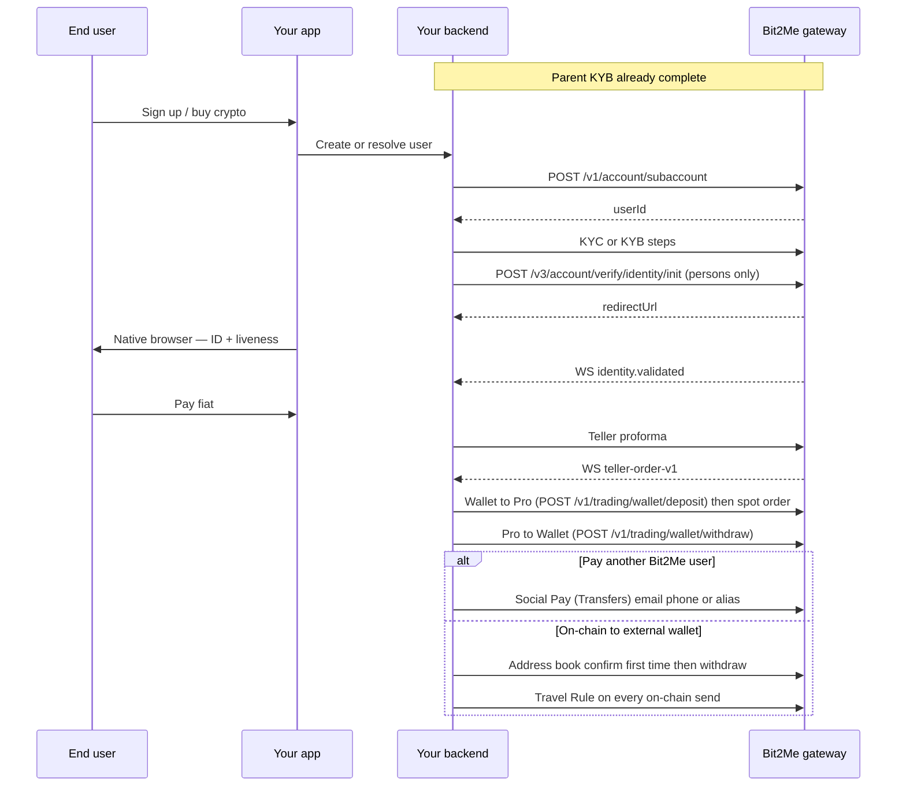

{/* COMPLIANCE_BLOCKER */}

Genericize this map for any bank or neobroker. Do not copy a single partner's contract.

## Auth layers

| Layer | Mechanism | Used for |
| --- | --- | --- |
| Parent HMAC | `x-api-key`, `api-signature`, `x-nonce` | Create subaccount, server-side treasury |
| Subaccount header | `X-SUBACCOUNT-ID: {userId}` | User-scoped REST |
| Subaccount session | `POST /v1/signin/apikey` with `userId` | Embed widgets, some identity init contracts |
| 2FA | `x-totp` + `x-totp-type: gauth` | Withdrawals and other protected ops |

## Money path

1. Fiat arrives on Bit2Me rails (bank, card, wallet pay).
2. Convert on **Bit2Me Pro**: [Wallet → Pro → order → Pro → Wallet](/pro/first-order) (`POST /v1/trading/wallet/deposit` and `POST /v1/trading/wallet/withdraw`).
3. Deliver either:
   - **In-network:** [Social Pay](/partner/transfers) to another Bit2Me user (`email` / `phone` / `alias`). Local-currency last mile is **Argentina only**.
   - **On-chain:** [address-book withdrawal](/partner/withdrawals-address-book) to an external address. Verify the destination **the first time**; complete [Travel Rule](/partner/travel-rule) on **every** send.

Keep your own ledger of fiat allocated per subaccount. A minimum parent fiat balance can be part of initial setup. USD on Wallet is not documented as generally available.

Partner trading fees and invoice cadence are **contractual**. This portal publishes on-chain fees on the withdrawal proforma/draft and Pro min/max on `GET /v1/trading/market-config`. Do not read a partner bps split from OpenAPI.

<Warning>
This page describes the published API. It is not legal advice. Bit2Me Legal and Compliance must review KYC, KYB, Travel Rule, and 2FA copy before this portal is announced to partners.
</Warning>
