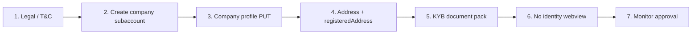

<Warning>
This page describes the published API. It is not legal advice. Bit2Me Legal and Compliance must review KYC, KYB, Travel Rule, and 2FA copy before this portal is announced to partners.
</Warning>

Do **not** call `POST /v3/account/verify/identity/init` for companies. Administrator IDs go in the document pack (`administratorDni`), not the person KYC widget.

## Overview



<Steps>
  <Step title="Show terms">
    Fetch `general` and `privacy-policy` latest documents. After create, you can verify acceptance with `GET /v1/terms-and-conditions-acceptance/terms-and-conditions/{termsAndConditionsId}`.
  </Step>
  <Step title="Create the corporate subaccount">
    ```http
    POST /v1/account/subaccount
    ```
    Body includes `type: company`. Response: `userId`. Then send `x-subaccount-id`.
  </Step>
  <Step title="Company profile">
    ```http
    PUT https://gateway.bit2me.com/v1/account/update
    ```
    Set `type: "company"`, `accountCompleted: true` when ready, and fill the `company` object (legal name, tax ID, activity, volumes, partners, UBO structure). Do not use the person verification path.
  </Step>
  <Step title="Registered address">
    `POST /v2/account/address` then upload `documentType: registeredAddress` via `POST /v2/account/user/documentation/docs/bulk`.
  </Step>
  <Step title="Upload the KYB pack">
    Submit **applicable** types only. Compliance will approve, reject, or request more. Types include source of funds, administrator ID, articles of incorporation, UBO, AML policy, and jurisdiction-specific FIU registrations. The API spelling for KYC policy is `kycPoliciy`.
  </Step>
  <Step title="Skip identity init">
    Companies are reviewed from the document pack, not ID + liveness.
  </Step>
  <Step title="Monitor approval">
    Person KYC success (`verified` + tier 2) does **not** apply here. Confirm the corporate status signal with your Bit2Me onboarding contact — a dedicated public status path is not published in the same form as person KYC.
  </Step>
</Steps>

## KYC vs KYB

| | KYC (person) | KYB (company) |
| --- | --- | --- |
| Subaccount `type` | Person | `company` |
| Identity webview | Required | Forbidden |
| Primary evidence | ID + liveness + address/funds docs | Corporate document pack |
| Completion | `verified` + tier 2 | Compliance approval |

<Info>
Check [status.bit2me.com](https://status.bit2me.com) before you debug a timeout or 5xx. If the platform is healthy and the error persists, [open a support ticket](https://support.bit2me.com).
</Info>
