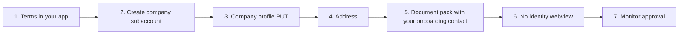

{/* COMPLIANCE_BLOCKER */}

<Warning>
This page describes the published API. It is not legal advice. Bit2Me Legal and Compliance must review KYC, KYB, Travel Rule, and 2FA copy before this portal is announced to partners.
</Warning>

Do **not** call `POST /v3/account/verify/identity/init` for companies. Do not use the person KYC widget for administrator IDs.

## Overview



<Steps>
  <Step title="Show terms">
    Collect general and privacy-policy acceptance in your application before create. Terms download and acceptance-check paths are not in this OpenAPI snapshot.
  </Step>
  <Step title="Create the corporate subaccount">
    ```http
    POST /v1/account/subaccount
    ```
    Required: `email`, `name`, `surname`, `phone`, and `type: company`. Response: `userId`. Then send `X-SUBACCOUNT-ID`.
  </Step>
  <Step title="Company profile">
    ```http
    PUT /v1/account/update
    ```
    Set `type: "company"` and fill the `company` object from the snapshot (`CompanyParam`). Do not send `accountCompleted` on this PUT — that field appears on **GET** `/v3/account`. Do not use the person verification path.
  </Step>
  <Step title="Registered address">
    `POST /v2/account/address` with the same required fields as person KYC (`streetAddress`, `city`, `stateCode`, `zip`, `countryCode`, `nationalityCountryCode`).
  </Step>
  <Step title="Document pack">
    Specific document-type enums (`administratorDni`, `registeredAddress`, `kycPoliciy`) are **not** in this snapshot. Submit the pack your Bit2Me onboarding contact specifies. Compliance will approve, reject, or request more.
  </Step>
  <Step title="Skip identity init">
    Companies are reviewed from the document pack, not ID + liveness.
  </Step>
  <Step title="Monitor approval">
    Person KYC success (`verified` + tier 2) does **not** apply here. Confirm the corporate status signal with your Bit2Me onboarding contact — a dedicated public status path is not published in the same form as person KYC.
  </Step>
</Steps>

## KYC vs KYB

| | KYC (person) | KYB (company) |
| --- | --- | --- |
| Subaccount `type` | Person | `company` |
| Identity webview | Required | Forbidden |
| Primary evidence | ID + liveness + address | Corporate document pack (types from your onboarding contact) |
| Completion | `verified` + tier 2 | Compliance approval — no public equivalent in this snapshot |

<Info>
Check [status.bit2me.com](https://status.bit2me.com) before you debug a timeout or 5xx. If the platform is healthy and the error persists, [open a support ticket](https://support.bit2me.com/en/support/tickets/new).
</Info>
