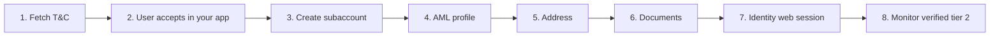

<Warning>
This page describes the published API. It is not legal advice. Bit2Me Legal and Compliance must review KYC, KYB, Travel Rule, and 2FA copy before this portal is announced to partners.
</Warning>

Identity is **only** Bit2Me’s hosted flow (photo ID + video liveness). You cannot send your own ID scan or run liveness on your servers.

Legal entities use [KYB](/partner/kyb) — do not mix this flow into companies.

## Before you start

| Item | Requirement |
| --- | --- |
| Parent | Your institution is already onboarded |
| Per end user | One subaccount (`userId` UUID) |
| After create | `x-subaccount-id: {userId}` on every call |
| Consent | User accepts **general** and **privacy-policy** in **your** UI before you create the subaccount |



<Steps>
  <Step title="Fetch Terms & Conditions">
    ```http
    GET /v1/terms-and-conditions/subject/general/language/{language}/latest
    GET /v1/terms-and-conditions/subject/privacy-policy/language/{language}/latest
    ```
    Language is BCP-47 (`es-ES`, `en-GB`, `fr-FR`). Store `termsAndConditionsId` for audit.
  </Step>
  <Step title="Record acceptance in your application">
    Store who accepted, when, and which document versions. Do not create the subaccount until this is done.
  </Step>
  <Step title="Create the subaccount">
    ```http
    POST /v1/account/subaccount
    ```
    Result: `userId`. From now on send `x-subaccount-id`. Initial acceptance is recorded on create — you do not need a separate terms POST for first onboarding.
  </Step>
  <Step title="Update the AML profile">
    ```http
    PUT /v1/account/update
    ```
    Include `nationalityCountryCode`, `employmentStatus`, `profession`, `accountPurpose`, `depositEstimation`, `fundsOrigin`.

    **Do not** send `name`, `surname`, or `birthDate` — identity verification collects those.

    Validate enums first: `GET /v1/account/employment-status`, `/v1/account/purposes`, `/v1/account/funds-origin`.
  </Step>
  <Step title="Register the physical address">
    ```http
    POST /v2/account/address
    ```
    Required: `streetAddress`, `city`, `stateCode`, `zip`, `countryCode`.
  </Step>
  <Step title="Upload compliance documents">
    Proof of address: `POST /v2/account/user/documentation/docs/bulk`. Proof of funds: `POST /v2/account/sign-document/source-of-funds-pf`.
  </Step>
  <Step title="Identity verification">
    ```http
    POST /v3/account/verify/identity/init
    ```
    Body: `locale` (required); optional `workflowId` (default `10011`), `successUrl`, `errorUrl`. Open **`redirectUrl`** in a **native system browser**. See [Identity widget](/partner/embed-identity).
  </Step>
  <Step title="Monitor until verified">
    REST: `GET /v1/account/verify/identity`. Real-time: WebSocket `identity.validated`.

    Success:

    ```json
    {
      "status": "verified",
      "tier": 2
    }
    ```

    Optional artifacts: `GET /v1/verifier/subaccount/file`.
  </Step>
</Steps>

## Common mistakes

1. Creating the subaccount before the user accepts terms in your app.
2. Sending name / surname / birthDate in the AML profile.
3. Embedding identity in a WebView without camera or microphone.
4. Uploading partner-captured ID or liveness.
5. Skipping address or proof of funds before identity init.
6. Treating the user as live before `verified` and `tier: 2`.

<Info>
Check [status.bit2me.com](https://status.bit2me.com) before you debug a timeout or 5xx. If the platform is healthy and the error persists, [open a support ticket](https://support.bit2me.com).
</Info>
