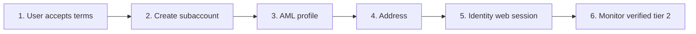

{/* COMPLIANCE_BLOCKER */}

<Warning>
This page describes the published API. It is not legal advice. Bit2Me Legal and Compliance must review KYC, KYB, Travel Rule, and 2FA copy before this portal is announced to partners.
</Warning>

Identity is **only** Bit2Me’s hosted flow (photo ID + video liveness). You cannot send your own ID scan or run liveness on your servers.

Legal entities use [KYB](/partner/kyb) — do not mix this flow into companies.

## Before you start

| Item | Requirement |
| --- | --- |
| Parent | Your institution is already onboarded |
| Per end user | One subaccount (`userId` UUID) |
| After create | `X-SUBACCOUNT-ID: {userId}` on every call |
| Consent | User accepts **general** and **privacy-policy** terms in **your** UI before you create the subaccount |

Terms download paths are not in this OpenAPI snapshot. Store the document versions the user accepted in your application.



<Steps>
  <Step title="Record acceptance in your application">
    Store who accepted, when, and which document versions. Do not create the subaccount until this is done.
  </Step>
  <Step title="Create the subaccount">
    ```http
    POST /v1/account/subaccount
    ```
    Required body fields in the snapshot: `email`, `name`, `surname`, `phone`. Optional `type` (`person` or `company`). Result: `userId`. From now on send `X-SUBACCOUNT-ID`.
  </Step>
  <Step title="Update the AML profile">
    ```http
    PUT /v1/account/update
    ```
    Send person AML fields under **`person`**: `nationalityCountryCode`, `employmentStatus`, `profession`. Also send `depositEstimation` and `fundsOrigin` at the root when required.

    **Do not** send `person.name`, `person.surname`, or `person.birthDate` — identity verification collects those. `accountPurpose` is a **GET** `/v3/account` field, not a PUT field.

    Validate enums first: `GET /v1/account/employment-status`, `GET /v1/account/purposes`, `GET /v1/account/funds-origin`.
  </Step>
  <Step title="Register the physical address">
    ```http
    POST /v2/account/address
    ```
    Required: `streetAddress`, `city`, `stateCode`, `zip`, `countryCode`, `nationalityCountryCode`. `stateCode` is the FIPS value from `GET /v1/misc/country/{countryISOCode}/region`.
  </Step>
  <Step title="Identity verification">
    ```http
    POST /v3/account/verify/identity/init
    ```
    Body: `locale` (required); optional `workflowId` (default `10011`), `successUrl`, `errorUrl`. Open **`redirectUrl`** in a **native system browser**. See [Identity widget](/partner/embed-identity).

    Proof-of-address and proof-of-funds upload paths are not in this snapshot. Complete any extra document requests your onboarding contact specifies before you treat the user as live.
  </Step>
  <Step title="Monitor until verified">
    REST: `GET /v1/account/verify/identity`. Real-time: WebSocket `identity.validated`.

    Success in the snapshot is `status: verified`. `tier` is optional. Treat the user as live only when `status` is `verified` and `tier` is `2` when that field is present.

    Optional artifacts: `GET /v1/verifier/subaccount/file`.
  </Step>
</Steps>

## Common mistakes

1. Creating the subaccount before the user accepts terms in your app.
2. Sending name / surname / birthDate on the AML `PUT`.
3. Embedding identity in a WebView without camera or microphone.
4. Uploading partner-captured ID or liveness.
5. Omitting `nationalityCountryCode` on the address.
6. Treating the user as live before `verified` (and `tier: 2` when returned).

<Info>
Check [status.bit2me.com](https://status.bit2me.com) before you debug a timeout or 5xx. If the platform is healthy and the error persists, [open a support ticket](https://support.bit2me.com/en/support/tickets/new).
</Info>
