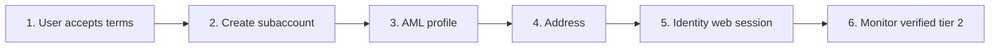

{/* COMPLIANCE_BLOCKER */}

<Warning>
This page describes the published API. It is not legal advice. Bit2Me Legal and Compliance must review KYC, KYB, Travel Rule, and 2FA copy before this portal is announced to partners.
</Warning>

Identity is **only** Bit2Me’s hosted flow (photo ID + video liveness). You cannot send your own ID scan or run liveness on your servers.

Legal entities use [KYB](/partner/kyb) — do not mix this flow into companies.

## Before you start

| Item | Requirement |
| --- | --- |
| Parent | Your institution is already onboarded |
| Per end user | One subaccount (`userId` UUID) |
| After create | `X-SUBACCOUNT-ID: {userId}` on every call |
| Consent | User accepts **general** and **privacy-policy** terms in **your** UI before you create the subaccount |

Terms download paths are not in this OpenAPI snapshot. Store the document versions the user accepted in your application.


```mermaid
flowchart LR
  A[1. User accepts terms] --> B[2. Create subaccount]
  B --> C[3. AML profile]
  C --> D[4. Address]
  D --> E[5. Identity web session]
  E --> F[6. Monitor verified tier 2]
```

<Steps>
  <Step title="Record acceptance in your application">
    Store who accepted, when, and which document versions. Do not create the subaccount until this is done.
  </Step>
  <Step title="Create the subaccount">
    ```http
    POST /v1/account/subaccount
    ```
    Required body fields in the snapshot: `email`, `name`, `surname`, `phone`. Optional `type` (`person` or `company`). Result: `userId`. From now on send `X-SUBACCOUNT-ID`.
  </Step>
  <Step title="Update the AML profile">
    ```http
    PUT /v1/account/update
    ```
    Send person AML fields under **`person`**: `nationalityCountryCode`, `employmentStatus`, `profession`. Also send `depositEstimation` and `fundsOrigin` at the root when required.

    **Do not** send `person.name`, `person.surname`, or `person.birthDate` — identity verification collects those. `accountPurpose` is a **GET** `/v3/account` field, not a PUT field.

    Validate enums first: `GET /v1/account/employment-status`, `GET /v1/account/purposes`, `GET /v1/account/funds-origin`.
  </Step>
  <Step title="Register the physical address">
    ```http
    POST /v2/account/address
    ```
    Required: `streetAddress`, `city`, `stateCode`, `zip`, `countryCode`, `nationalityCountryCode`. `stateCode` is the FIPS value from `GET /v1/misc/country/{countryISOCode}/region`.
  </Step>
  <Step title="Identity verification">
    ```http
    POST /v3/account/verify/identity/init
    ```
    Body: `locale` (required); optional `workflowId` (default `10011`), `successUrl`, `errorUrl`. Open **`redirectUrl`** in a **native system browser**. See [Identity widget](/partner/embed-identity).

    Proof-of-address and proof-of-funds upload paths are not in this snapshot. Complete any extra document requests your onboarding contact specifies before you treat the user as live.
  </Step>
  <Step title="Monitor until verified">
    REST: `GET /v1/account/verify/identity`. Real-time: WebSocket `identity.validated`.

    Success in the snapshot is `status: verified`. `tier` is optional. Treat the user as live only when `status` is `verified` and `tier` is `2` when that field is present.

    Optional artifacts: `GET /v1/verifier/subaccount/file`.
  </Step>
</Steps>

## Operating rules

These rules apply to any partner subaccount. They are not a single-customer exception.

### Document rejection is not a session expiry

Closure dates are document rejections or manual closures, not Didit session expirations. A stored image means the front side was received. Didit may return `unknown`; an operator can reclassify it (`imageDoc` = unusable document image). The same image can be closed with no new capture.

| Code | Meaning |
| --- | --- |
| `docMissingImage` | A required image is missing (back side or selfie). The front may already be on file. |
| `noDocUploaded` | Manual closure. No image was uploaded. |
| `imageDoc` | The document image is unusable. |

Didit labels these `Expired` and `Abandoned`. Bit2Me does not convert them into those errors. `error` and `errorReviewed` do not block a restart. The user can open a full capture (front, back, and selfie) once they are under the session cap. Operations can reset the attempt counter.

### Session cap

The cap is **3 sessions in 15 days** (`maxRetriesReached`). The counter includes every verification session created in that window, including sessions where nothing was captured. It is not the number of sessions the user thinks they started. A QR opened in Android's in-app browser can create and abandon a session before the camera and still increment the counter. See [Identity widget](/partner/embed-identity).

Those events store no device, browser, user agent, or camera error. The closure email is `identity.rejected` (English subject: _Document pending verification_). The payload has no reason and no new link. The HTML body is not reproduced here.

### Enhanced measures

Identity can already be captured (email, phone, questionnaire, document image) while the only error is `enhancedMeasuresNotReceived` and status is `waitingUser`. The user does not redo identity verification.

| Score | Band | What happens |
| --- | --- | --- |
| 8–9 | High | Documentation is requested at verification. There is no deposit threshold. |
| 9 | Cap | The engine raises risk to 9 when the nationality score is 5 or 7, or the residence score is 4. |
| 6 | Medium-high | Measures apply only from €10,000 cumulative. This does not block before a deposit. |

Whether a nationality and residence pair should score 6 or 9 is a Compliance confirmation. The API does not decide it.

The system does not ask for a named file list. It opens AML measure **MR1** and a generic `reinforcedMeasures` document in a requested state. Compliance defines the package. There is no partner endpoint to upload it. The channel is the Zoho Sign form in the email `identity.enhanced.measures.required` (English subject: _Documentation pending_) until the API supports upload.

On a subaccount that email goes to the **partner's internal address**, not the end client. The partner must forward it.

| Language | Form |
| --- | --- |
| EN | [Zoho Sign (EN)](https://sign.zoho.com/signform?form_link=234b4d535f495623fe64f983dacfe91979ffde926af98538b1865a03a2e122b1a43d36dd60c5f3bbb7b9297c7df992fdcdce07215d3cb346c546a0d7a7aa11d83776e042e8774e99#) |
| ES | [Zoho Sign (ES)](https://sign.zoho.com/signform?form_link=234b4d535f4956232755c614571227cc2c81e2048bf1fa74dbbf18c710eae21da1924d3834b221571f40f26885a58665857d585d779209b2259864a910ae7173a19e15cf7046c36a#) |

### HTTP 409 on subaccount creation

**409** is two errors. Read `errorCode` in the response body. A partner link id or party id is not in account or auth logs, so the body is required.

| `errorCode` | Message | Rule |
| --- | --- | --- |
| `B2M_AUTH_PHONE_DUPLICATED` | The phone already exists | Checked against any individual Bit2Me user, including direct accounts. A registered phone blocks creation. Phone numbers cannot be reused. |
| `B2M_AUTH_EMAIL_DUPLICATED` | Duplicated email | Stored as `{mainUserId}###{email}`. Does not conflict with a direct Bit2Me account. Conflicts with another subaccount of the **same** partner. |

"Same email or phone as a Bit2Me account" is true only for the phone.

### Document type when nationality and residence differ (outside the EEA)

`unsupportedIdTypeResidenceCountry` is a document-type block, not a risk-score block. If nationality is not the residence country and residence is **outside the EEA**, only a document **issued by the residence country** is accepted:

| Code | Document |
| --- | --- |
| `idcard` | National ID card of the residence country |
| `foreign-id-card` | Resident card or residence permit issued by that country |

A national ID card or passport of the nationality country is not accepted. Attempts can be reset so the user starts again with a residence-country document. This note does not state the rule inside the EEA, or when nationality and residence are the same country.

## Common mistakes

1. Creating the subaccount before the user accepts terms in your app.
2. Sending name / surname / birthDate on the AML `PUT`.
3. Embedding identity in a WebView without camera or microphone, or opening the QR in an in-app browser so abandoned sessions count toward the cap.
4. Uploading partner-captured ID or liveness.
5. Omitting `nationalityCountryCode` on the address.
6. Treating the user as live before `verified` (and `tier: 2` when returned).
7. Reading a document-rejection date as a Didit session expiry.
8. Telling the partner that a **409** means "same email or phone as a Bit2Me account" without the `errorCode`.
9. Asking the end user to redo identity when the only error is `enhancedMeasuresNotReceived`.

<Info>
Check [status.bit2me.com](https://status.bit2me.com) before you debug a timeout or 5xx. If the platform is healthy and the error persists, [open a support ticket](https://support.bit2me.com/en/support/tickets/new).
</Info>
