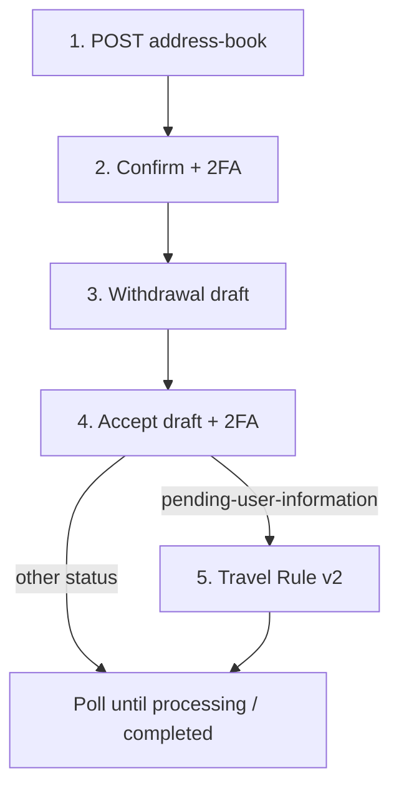

<Warning>
This page describes the published API. It is not legal advice. Bit2Me Legal and Compliance must review KYC, KYB, Travel Rule, and 2FA copy before this portal is announced to partners.
</Warning>

This is the current OpenAPI **target** path for subaccount crypto out. The Wallet proforma path remains live — see [Wallet legacy](/partner/withdrawals-wallet). Follow the **API response**. Do not assume Travel Rule on every withdrawal. Do not invent address-book TTLs or sunset dates.



## Prerequisites

- Subaccount KYC or KYB complete.
- Google Authenticator enabled. For subaccounts, `x-totp-type` is always `gauth`.
- Destination address, network, and Travel Rule wallet declaration (`walletType`, `walletOwnership`; `exchangeName` / person fields when required).

<Steps>
  <Step title="Create an address-book entry">
    ```http
    POST /v1/blockchain-manager/address-book
    ```
    Always send `address`, `currency`, `network`, `walletType` (`unhosted` or `exchange`), `walletOwnership` (`own` or `other`). Add `exchangeName` when the type is `exchange`. Optional `tag` for memo/destination tag.

    **201** includes `addressId` and `status`: `validating` | `verified` | `expired`. **409** means an active entry already exists.

    How long `validating` lasts before `expired` is **not published**.
  </Step>
  <Step title="Confirm the entry (subaccounts)">
    ```http
    POST /v1/compliance/address-book/{addressBookId}/confirm
    ```
    TOTP required. **204**. **403** if not a subaccount. **420** invalid 2FA. Idempotent if already approved.
  </Step>
  <Step title="Create a withdrawal draft">
    ```http
    POST /v1/blockchain-manager/order/withdrawal/draft
    ```
    Body: `addressBookId` plus `amount.value` / `amount.currency`. No funds move. Accept before `expiresAt` from the **201** body — OpenAPI does not publish a fixed lock in minutes.
  </Step>
  <Step title="Accept the draft">
    ```http
    POST /v1/blockchain-manager/order/withdrawal/draft/accept
    ```
    For **stablecoin** withdrawals, missing TOTP returns **428**. Subaccounts use `gauth`.
  </Step>
  <Step title="Travel Rule only if requested">
    ```http
    POST /v2/blockchain-manager/travel-rule-order/{orderId}
    ```
    Required **only** when status is `pending-user-information` (OpenAPI) or `pending_user_information` (Wallet GET). Do not use Travel Rule v1 (deprecated). If requested and not sent, the operation stays in that status and is cancelled within a few hours. EUR threshold is not published here.
  </Step>
</Steps>

Per-movement address confirmation (`/v1/compliance/blockchain-address-confirmation/wallet-movement/...`) is deprecated in OpenAPI in favour of address-book confirm.

<Info>
Check [status.bit2me.com](https://status.bit2me.com) before you debug a timeout or 5xx. If the platform is healthy and the error persists, [open a support ticket](https://support.bit2me.com).
</Info>
