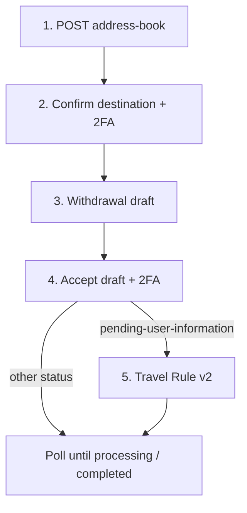

<Warning>
This page describes the published API. It is not legal advice. Bit2Me Legal and Compliance must review KYC, KYB, Travel Rule, and 2FA copy before this portal is announced to partners.
</Warning>

This is the current OpenAPI **target** path for subaccount crypto out. The Wallet proforma path remains live — see [Wallet legacy](/partner/withdrawals-wallet). Follow the **API response**. Do not invent address-book TTLs or sunset dates.

## Verify the destination wallet first

The first time a subaccount withdraws to a **new** on-chain address, you must save that destination and confirm it with 2FA before any funds move. OpenAPI: the entry **may require confirmation before it can be used**.

1. `POST /v1/blockchain-manager/address-book` — create the destination.
2. `POST /v1/compliance/address-book/{addressBookId}/confirm` — verify it (`x-totp` + `x-totp-type: gauth`). **204**. Idempotent if already approved.

Do not call withdrawal draft until that confirmation succeeds (or the entry is already `verified`). Later withdrawals to the **same** confirmed entry reuse `addressBookId`. They do not need a new address-book create. Confirm again only if you create a new entry.

This verification is **not** Travel Rule. Travel Rule is a later call, documented on [Travel Rule](/partner/travel-rule).



## Prerequisites

- Subaccount KYC or KYB complete.
- Google Authenticator enabled. For subaccounts, `x-totp-type` is always `gauth`.
- Destination address, network, and wallet declaration on the address-book create (`walletType`, `walletOwnership`; `exchangeName` when type is `exchange`).

<Steps>
  <Step title="Save the destination">
    ```http
    POST /v1/blockchain-manager/address-book
    ```
    Always send `address`, `currency`, `network`, `walletType` (`unhosted` or `exchange`), `walletOwnership` (`own` or `other`). Add `exchangeName` when the type is `exchange`. Optional `tag` for memo/destination tag.

    **201** includes `addressId` and `status`: `validating` | `verified` | `expired`. **409** means an active entry already exists.

    How long `validating` lasts before `expired` is **not published**.
  </Step>
  <Step title="Verify the destination wallet (required on first use)">
    ```http
    POST /v1/compliance/address-book/{addressBookId}/confirm
    ```
    Subaccounts cannot use the email confirmation token. Confirm with TOTP instead. **204**. **403** if not a subaccount. **420** invalid 2FA. Idempotent if already approved.

    Per-movement confirmation (`/v1/compliance/blockchain-address-confirmation/wallet-movement/...`) is deprecated. Use this address-book confirm instead.
  </Step>
  <Step title="Create a withdrawal draft">
    ```http
    POST /v1/blockchain-manager/order/withdrawal/draft
    ```
    Body: `addressBookId` plus `amount.value` / `amount.currency`. The draft requires a **verified** address-book entry. No funds move. Accept before `expiresAt` from the **201** body — OpenAPI does not publish a fixed lock in minutes.
  </Step>
  <Step title="Accept the draft">
    ```http
    POST /v1/blockchain-manager/order/withdrawal/draft/accept
    ```
    For **stablecoin** withdrawals, missing TOTP returns **428**. Subaccounts use `gauth`.
  </Step>
  <Step title="Travel Rule only if the status asks">
    ```http
    POST /v2/blockchain-manager/travel-rule-order/{orderId}
    ```
    This is how you **submit Travel Rule** (originator and beneficiary data). It is not Embed `report`.

    Required **only** when status is `pending-user-information` (OpenAPI) or `pending_user_information` (Wallet GET). Full field notes: [Travel Rule](/partner/travel-rule). Do not use Travel Rule v1. If requested and not sent, the operation stays in that status and is cancelled within a few hours. EUR threshold is not published here.
  </Step>
</Steps>

<Info>
Check [status.bit2me.com](https://status.bit2me.com) before you debug a timeout or 5xx. If the platform is healthy and the error persists, [open a support ticket](https://support.bit2me.com).
</Info>
