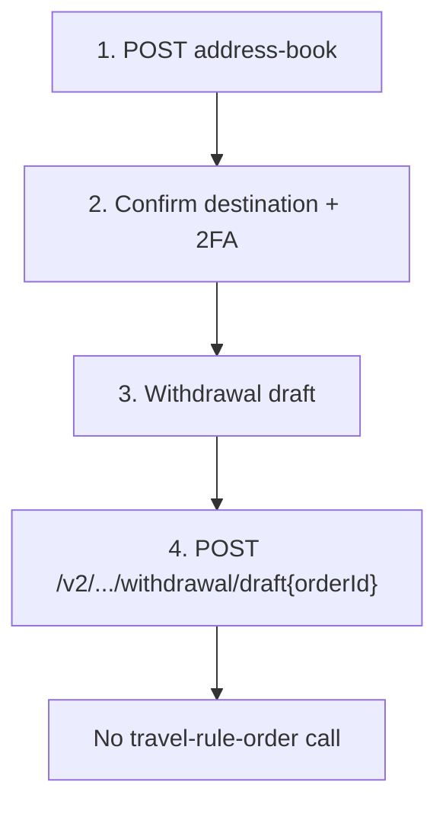

{/* COMPLIANCE_BLOCKER */}

<Warning>
  This page describes the published API. It is not legal advice. Bit2Me Legal and Compliance must review KYC, KYB, Travel Rule, and 2FA copy before this portal is announced to partners.
</Warning>

This is the current OpenAPI **target** path for subaccount crypto out. The Wallet proforma path remains live — see [Wallet legacy](/partner/withdrawals-wallet). Follow the **API response**. Do not invent address-book TTLs or sunset dates.

Once the withdrawal address is validated, Travel Rule data is already on the address-book entry. Do **not** call `POST /v2/blockchain-manager/travel-rule-order/{orderId}`. That call belongs to [Wallet legacy](/partner/withdrawals-wallet) only.

## Verify the destination wallet first

The first time a subaccount withdraws to a **new** on-chain address, you must save that destination and confirm it with 2FA before any funds move. OpenAPI: the entry **may require confirmation before it can be used**.

1. `POST /v1/blockchain-manager/address-book` — create the destination, including `walletType`, `walletOwnership`, and `exchangeName` when required.
2. `POST /v1/compliance/address-book/{addressBookId}/confirm` — verify it (`x-totp` + `x-totp-type: gauth`). **204**. Idempotent if already approved.

Do not call withdrawal draft until that confirmation succeeds (or the entry is already `verified`). Later withdrawals to the **same** confirmed entry reuse `addressBookId`. They do not need a new address-book create. Confirm again only if you create a new entry.


```mermaid
flowchart TD
  A[1. POST address-book] --> B[2. Confirm destination + 2FA]
  B --> C[3. Withdrawal draft]
  C --> D["4. POST /v2/.../withdrawal/draft{orderId}"]
  D --> E[No travel-rule-order call]
```

## Prerequisites

- Subaccount KYC or KYB complete.
- Google Authenticator enabled. For subaccounts, `x-totp-type` is always `gauth`.
- Destination address, network, and wallet declaration on the address-book create (`walletType`, `walletOwnership`; `exchangeName` when type is `exchange`).

<Steps>
  <Step title="Save the destination">
    ```http
    POST /v1/blockchain-manager/address-book
    ```

    Always send `address`, `currency`, `network`, `walletType` (`unhosted` or `exchange`), `walletOwnership` (`own` or `other`). Add `exchangeName` when the type is `exchange`. Optional `tag` for memo/destination tag.

    **201** includes `addressId` and `status`: `validating` | `verified` | `expired`. **409** means an active entry already exists.

    How long `validating` lasts before `expired` is **not published**.
  </Step>
  <Step title="Verify the destination wallet (required on first use)">
    ```http
    POST /v1/compliance/address-book/{addressBookId}/confirm
    ```

    Subaccounts cannot use the email confirmation token. Confirm with TOTP instead. **204**. **403** if not a subaccount. **420** invalid 2FA. Idempotent if already approved.

    Per-movement confirmation (`/v1/compliance/blockchain-address-confirmation/wallet-movement/...`) is deprecated. Use this address-book confirm instead.
  </Step>
  <Step title="Create a withdrawal draft">
    ```http
    POST /v1/blockchain-manager/order/withdrawal/draft
    ```

    Body: `addressBookId` plus `amount.value` / `amount.currency`. Do **not** send `type`.

    `amount` is **REA** only. The value is the amount that will be attempted to be sent, and the network fee is added on top. The pocket must cover that amount plus the current network fee. **SEA** (state an amount and subtract the fee from it) is the [Wallet proforma](/partner/withdrawals-wallet) behavior. It is not available on this call.

    The draft requires a **verified** address-book entry. No funds move. Use `expiresAt` from the **201** body — OpenAPI does not publish a fixed lock in minutes.
  </Step>
  <Step title="Second call after the draft">
    ```http
    POST /v2/blockchain-manager/order/withdrawal/draft{orderId}
    ```

    This path is written **without** a slash before `{orderId}`. Do not insert one, and do not add a body that was not stated. It is **not** the same call as `POST /v1/blockchain-manager/order/withdrawal/draft/accept` (that accept takes `draftId` in the body).

    Do **not** call `POST /v2/blockchain-manager/travel-rule-order/{orderId}`. `walletType`, `walletOwnership`, and `exchangeName` are already on the verified entry.
  </Step>
  <Step title="Do not track this orderId as a Wallet transaction">
    The blockchain-manager `orderId` is **not** the wallet transaction id. Do not read it with `GET /v1/wallet/transaction/{orderId}`. It is **not** the id on `wallet.*` WebSocket events, including `wallet-transaction-v1`. It is **not** confirmed to be a teller id.

    These lookups are known and **not prioritized**: Wallet transactions by this OrderID, all orders of a user, and one order by OrderID.
  </Step>
</Steps>

<Info>
  Check [status.bit2me.com](https://status.bit2me.com) before you debug a timeout or 5xx. If the platform is healthy and the error persists, [open a support ticket](https://support.bit2me.com/en/support/tickets/new).
</Info>
