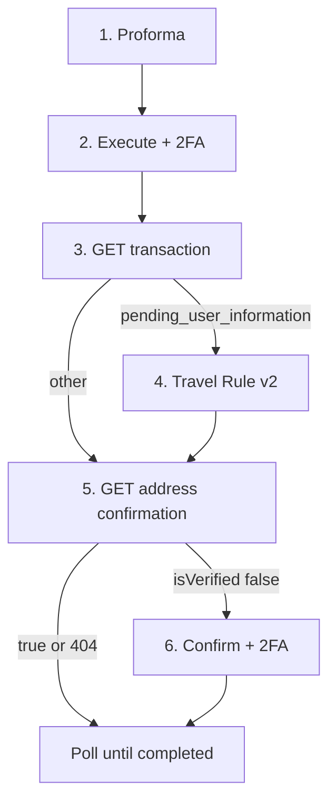

<Warning>
This page describes the published API. It is not legal advice. Bit2Me Legal and Compliance must review KYC, KYB, Travel Rule, and 2FA copy before this portal is announced to partners.
</Warning>

`POST /v1/wallet/transaction/proforma` and `POST /v1/wallet/transaction` are **not** marked deprecated. Prefer [address book](/partner/withdrawals-address-book) for new subaccount work. Sunset dates are not published.

Two optional branches after execute. Prefer [address book](/partner/withdrawals-address-book) for **new** destinations: that path verifies the wallet **before** you withdraw.

| Branch | What it is | Required when | Skip when |
| --- | --- | --- | --- |
| Travel Rule | Submit originator/beneficiary data to Bit2Me (`POST /v2/blockchain-manager/travel-rule-order/{id}`). Not Embed `report`. | Status is `pending_user_information` | Status is anything else |
| Destination verification | Confirm the on-chain destination for this movement | `isVerified: false` | Already verified, or GET stays 404 |



<Steps>
  <Step title="Create the proforma">
    ```http
    POST /v1/wallet/transaction/proforma
    ```
    `type: SEA` = send exact amount (pocket debited **amount + network fee**). If omitted, `REA` (receive exact amount). List networks: `GET /v1/wallet/network` or `GET /v1/wallet/currency/{currency}/network`. No 2FA on the quote.
  </Step>
  <Step title="Execute">
    ```http
    POST /v1/wallet/transaction
    ```
    Body field `proforma` is the quote id. Headers `x-totp` and `x-totp-type: gauth`. Store transaction `id`.
  </Step>
  <Step title="Inspect status">
    ```http
    GET /v1/wallet/transaction/{id}
    ```
    Call [Travel Rule](/partner/travel-rule) **only** for `pending_user_information`. Terminal statuses (`canceled`, `error`, `rejected`, `expired`) must not be retried with the same id.
  </Step>
  <Step title="Travel Rule (only if status asks)">
    ```http
    POST /v2/blockchain-manager/travel-rule-order/{orderId}
    ```
    `{orderId}` is the transaction id. This is the Travel Rule submission, not Embed `report`. Payload uses `walletType` / `walletOwnership` (plus person or exchange fields when required). See [Travel Rule](/partner/travel-rule).
  </Step>
  <Step title="Destination wallet verification (first use on this path)">
    OpenAPI marks this pair **deprecated** in favour of address-book confirm.

    `GET /v1/compliance/blockchain-address-confirmation/wallet-movement/{movementId}`. Confirm with 2FA only if `isVerified: false`. Persistent **404** means confirmation is not required for that movement.
  </Step>
</Steps>

HTTP map: **401** email not verified; **412** funds; **417** amount; **420** invalid 2FA; **423** blocked (case-specific); **428** 2FA required (stablecoins); Travel Rule **409** wrong status.

<Info>
Check [status.bit2me.com](https://status.bit2me.com) before you debug a timeout or 5xx. If the platform is healthy and the error persists, [open a support ticket](https://support.bit2me.com).
</Info>
