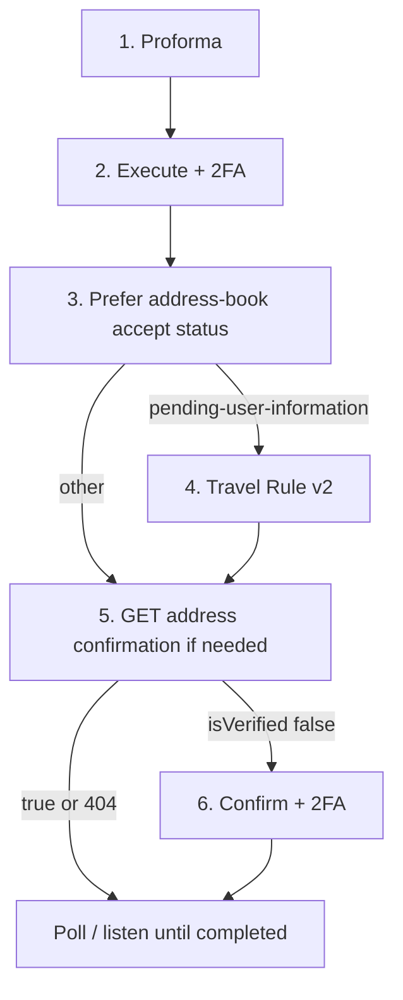

{/* COMPLIANCE_BLOCKER */}

<Warning>
This page describes the published API. It is not legal advice. Bit2Me Legal and Compliance must review KYC, KYB, Travel Rule, and 2FA copy before this portal is announced to partners.
</Warning>

`POST /v1/wallet/transaction/proforma` and `POST /v1/wallet/transaction` are **not** marked deprecated. Prefer [address book](/partner/withdrawals-address-book) for new subaccount work. Sunset dates are not published.

Two optional branches after execute. Prefer [address book](/partner/withdrawals-address-book) for **new** destinations: that path verifies the wallet **before** you withdraw and is the snapshot that returns `pending-user-information`.

| Branch | What it is | Required when | Skip when |
| --- | --- | --- | --- |
| Travel Rule | Submit originator/beneficiary data (`POST /v2/blockchain-manager/travel-rule-order/{id}`). Not Embed `report`. | Address-book accept **201** `status` is `pending-user-information` | Any other status |
| Destination verification | Confirm the on-chain destination for this movement (deprecated pair) | `isVerified: false` | Already verified, or GET stays 404 |



<Steps>
  <Step title="Create the proforma">
    ```http
    POST /v1/wallet/transaction/proforma
    ```
    `type: SEA` = send exact amount (pocket debited **amount + network fee**). If omitted, `REA` (receive exact amount). Network list REST paths are **not** in this snapshot — use the `network` field the address-book or currency catalog already returns. No 2FA on the quote.
  </Step>
  <Step title="Execute">
    ```http
    POST /v1/wallet/transaction
    ```
    Body field `proforma` is the quote id. Headers `x-totp` and `x-totp-type: gauth`. Snapshot **200** is `{ "result": true }` — it does **not** return a transaction `id`.
  </Step>
  <Step title="Inspect the movement">
    ```http
    GET /v1/wallet/transaction/{id}
    ```
    Use an id from list endpoints (`GET /v2/wallet/transaction` or `GET /v3/wallet/transaction`) or from WebSocket `wallet-transaction-v1`. This GET schema does **not** document `status`. Do not look for `pending_user_information` here.
  </Step>
  <Step title="Travel Rule (only if the API asks)">
    For **new** subaccount crypto out, use [address book](/partner/withdrawals-address-book): accept-draft **201** includes `status`. Call [Travel Rule](/partner/travel-rule) only when that value is `pending-user-information`. `{orderId}` is the withdrawal id from accept, not from Wallet execute.
  </Step>
  <Step title="Destination wallet verification (first use on this path)">
    OpenAPI marks this pair **deprecated** in favour of address-book confirm.

    `GET /v1/compliance/blockchain-address-confirmation/wallet-movement/{walletMovementId}`. Confirm with 2FA only if `isVerified: false`. Persistent **404** means confirmation is not required for that movement.
  </Step>
</Steps>

HTTP map on this path: **401** email not verified; **412** pocket funds; **417** amount; **420** invalid 2FA; **423** blocked (case-specific); **428** 2FA required (stablecoins); Travel Rule **409** wrong status.

<Info>
Check [status.bit2me.com](https://status.bit2me.com) before you debug a timeout or 5xx. If the platform is healthy and the error persists, [open a support ticket](https://support.bit2me.com/en/support/tickets/new).
</Info>
