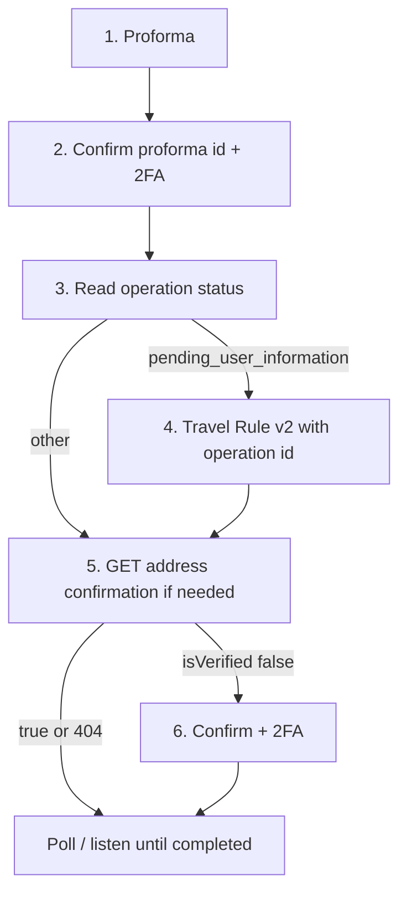

{/* COMPLIANCE_BLOCKER */}

<Warning>
This page describes the published API. It is not legal advice. Bit2Me Legal and Compliance must review KYC, KYB, Travel Rule, and 2FA copy before this portal is announced to partners.
</Warning>

`POST /v1/wallet/transaction/proforma` and `POST /v1/wallet/transaction` are **not** marked deprecated. Prefer [address book](/partner/withdrawals-address-book) for new subaccount work. Sunset dates are not published.

This path is **not** the address-book draft. Do not decide Travel Rule from an address-book accept status. [Address book](/partner/withdrawals-address-book) does not call `travel-rule-order`.

| Branch | What it is | Required when | Skip when |
| --- | --- | --- | --- |
| Travel Rule | `POST /v2/blockchain-manager/travel-rule-order/{orderId}` with the **operation id** from execute. Not Embed `report`. | Operation status is `pending_user_information` | Any other status |
| Destination verification | Confirm the on-chain destination for this movement (deprecated pair) | `isVerified: false` | Already verified, or GET stays 404 |


```mermaid
flowchart TD
  A[1. Proforma] --> B[2. Confirm proforma id + 2FA]
  B --> C[3. Read operation status]
  C -->|pending_user_information| D[4. Travel Rule v2 with operation id]
  C -->|other| E[5. GET address confirmation if needed]
  D --> E
  E -->|isVerified false| F[6. Confirm + 2FA]
  E -->|true or 404| G[Poll / listen until completed]
  F --> G
```

<Steps>
  <Step title="Create the proforma">
    ```http
    POST /v1/wallet/transaction/proforma
    ```
    `type: SEA` = send exact amount (pocket debited **amount + network fee**). If omitted, `REA` (receive exact amount). The [address-book draft](/partner/withdrawals-address-book) does **not** take `type`. Network list REST paths are **not** in this snapshot — use the `network` field the address-book or currency catalog already returns. No 2FA on the quote.
  </Step>
  <Step title="Execute">
    ```http
    POST /v1/wallet/transaction
    ```
    Body field `proforma` is the quote id from step 1. Headers `x-totp` and `x-totp-type: gauth`. The **200** returns the **operation id**. That id is not the proforma id. Use it for Travel Rule and for `GET /v1/wallet/transaction/{id}`.
  </Step>
  <Step title="Inspect the movement">
    ```http
    GET /v1/wallet/transaction/{id}
    ```
    `{id}` is the operation id from execute. Read `status`. `pending_user_information` means you must submit Travel Rule. Do not use a blockchain-manager order id from the address-book path on this GET.
  </Step>
  <Step title="Travel Rule (only if status asks)">
    ```http
    POST /v2/blockchain-manager/travel-rule-order/{orderId}
    ```

    `{orderId}` is the operation id from execute, **not** the proforma id. Call it only when `GET /v1/wallet/transaction/{id}` returned `pending_user_information`. Do not use Travel Rule v1. This step is **not** part of [address book](/partner/withdrawals-address-book).
  </Step>
  <Step title="Destination wallet verification (first use on this path)">
    OpenAPI marks this pair **deprecated** in favour of address-book confirm.

    `GET /v1/compliance/blockchain-address-confirmation/wallet-movement/{walletMovementId}`. Confirm with 2FA only if `isVerified: false`. Persistent **404** means confirmation is not required for that movement.
  </Step>
</Steps>

HTTP map on this path: **401** email not verified; **412** pocket funds; **417** amount; **420** invalid 2FA; **423** blocked (case-specific); **428** 2FA required (stablecoins); Travel Rule **409** wrong status.

<Info>
Check [status.bit2me.com](https://status.bit2me.com) before you debug a timeout or 5xx. If the platform is healthy and the error persists, [open a support ticket](https://support.bit2me.com/en/support/tickets/new).
</Info>
