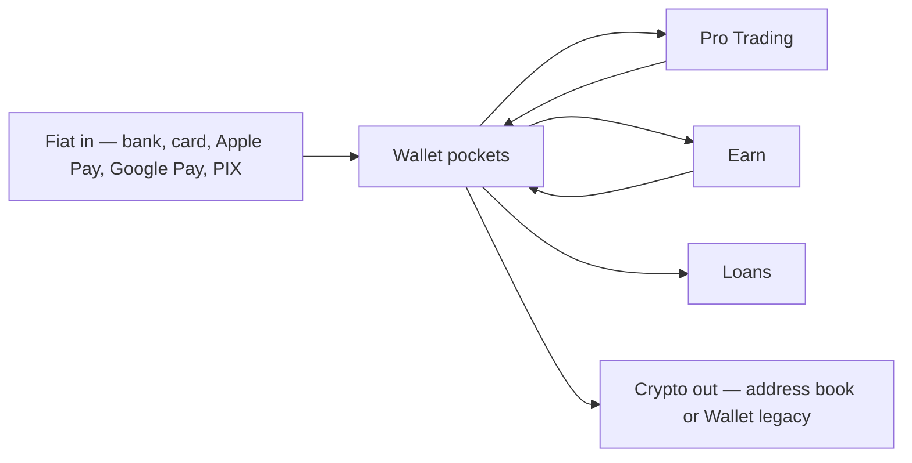

The public Money Flow spec is a diagram pack, not a REST catalog. Use this page as a map; the live numbers always come from pockets, Pro balances, and teller orders.

| Rail | Guide |
| --- | --- |
| Fiat deposit | [Fiat funding](/partner/fiat), [Apple Pay / Google Pay](/partner/apple-google-pay) |
| Wallet ↔ Pro | [First order](/pro/first-order) — `POST /v1/trading/wallet/deposit` and `POST /v1/trading/wallet/withdraw` |
| Spot orders | Same page, `POST /v1/trading/order` |
| Buy / sell in Wallet | [Buy, sell, and swap](/wallet/buy-sell) |
| On-chain out | [Address book withdrawals](/partner/withdrawals-address-book) (verify destination **first time**), [Travel Rule](/partner/travel-rule) **every** send |
| Bit2Me user | [Transfers](/partner/transfers) (Social Pay: email, phone, alias). Last mile: Argentina only |

SVG diagrams from the Money Flow OpenAPI (`trading-money-flows`, `earn-money-flows-a-end-users`) are not copied here. Follow REST responses for fees and pocket debits.
